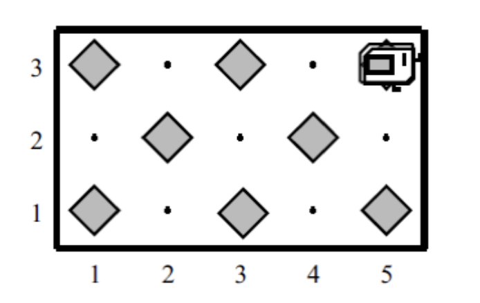

# ჭადრაკის დაფა

ამ ამოცანაში **კარელს** უნდა გააკეთებინოთ ჭადრაკის დაფა ბრილიანტებისაგან, ისე როგორც ნაჩვენებია ქვემოთ. ჩათვალეთ, რომ თავიდან სამყარო ცარიელია

ამოცანა ლამაზ დეკომპოზიციურ სტრუქტურასთან ერთად შეიცავს საინტერესო ალგორითმულ საკითხებს. დარწმუნდით რომ თქვენი ამოხსნა იმუშავებს დაფებისთვის, რომლებიც განსხვავდებიან  სტანდარტული 8x8 დაფისგან. ასევე გაითვალისწინეთ კენტი ზომების მქონე დაფები, როგორიცაა 5x3.

კიდევ ერთი კერძო შემთხვევა, რომელიც უნდა გაითვალისწინოთ არის დაფა რომელიც შედგება მხოლოდ ერთი სვეტისგან ან სტრიქონისგან. [ამ ბმულიდან](https://drive.google.com/file/d/1dcY1hwf9PawBRJ9WZuD5xZn2h-cmfdKD/view?usp=share_link) შეგიძლიათ გადმოიწეროთ სხვადასხვა სამყაროების მაგალითები, დარწმუნდით, რომ თქვენი პროგრამა მუშაობს თითოეული მათგანისთვის.

ამოხსნა დაწერეთ ChekerboardKarel.java ფაილში