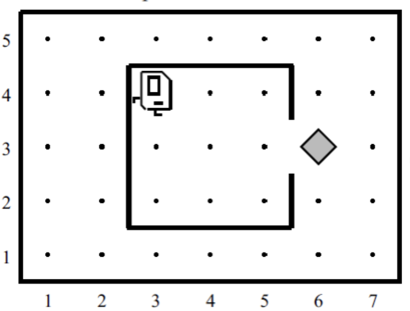

# გაზეთის აღება

თქვენი ამოცანა კარელის სამყაროსთვის მარტივი პროგრამის დაწერაა. წარმოიდგინეთ, რომ კარელი საკუთარ სახლში იმყოფება, რომელიც კვადრატული ფორმისაა და სამყაროს ცენტრში მდებარეობს:

როგორც სურათზეა ნაჩვენები, კარელი თავდაპირველად იმყოფება სახლის მარცხენა ზედა კუთხეში. თქვენი ამოცანაა ააღებინოთ კარელს გაზეთი და დააბრუნოთ კარელი საწყის პოზიციაზე. გაზეთი ბრილიანტის სახითაა წარმოდგენილი კარელის სამყაროში, რომელიც სახლის გარეთ დევს(იხ. სურათი).

ეს ამოცანა საკმაოდ მარტივია და მიზნად ისახავს კარელთან უკეთ გაცნობას. თქვენ შეგიძლიათ ჩათვალოთ რომ კარელის სამყარო გამოიყურება ზუსტად ისე როგორც სურათზეა ნაჩვენები. სახლი ყოველთვის ამ ზომისაა, "კარის" მდებარეობა ყოველთვის ისეთია როგორც სურათზე და ბრილიანტიც ზუსტად კარის წინ დევს.
თქვენი დავალებაა მხოლოდ დაწეროთ საჭირო ბრძანებების მიმდევრობა იმისათვის რომ კარელი
1. მივიდეს გაზეთთან,
2. აიღოს გაზეთი, და
3. დაბრუნდეს საწყის პოზიციაზე.

მიუხედავად იმისა რომ პროგრამა სულ რამოდენიმე ხაზს შეიცავს, სასურველია შეასულოთ გარკვეული დონის დეკომპოზიცია. კერძოდ, თქვენს პროგრამაში დაამატეთ თითო private მეთოდი თითოეული ბიჯისთვის, რომელიც ნაჩვენებია ზემოთ.

ამოხსნა დაწერეთ CollectNewspaperKarel.java ფაილში. კარელის სამყარო შეგიძლიათ [ამ ბმულიდან](https://drive.google.com/file/d/1Em0pfQ_Rf9FQJnYt_k1UDVTCjz4J1ESo/view?usp=share_link) გადმოიწეროთ