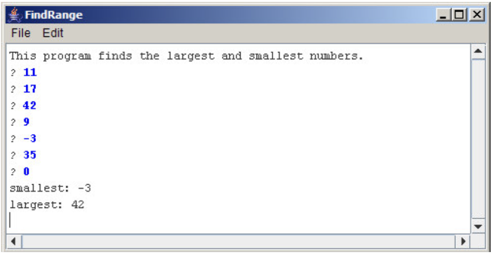

# დიდი და პატარა რიცხვების ძებნა
დაწერეთ ConsoleProgram, რომელიც ყოველი მომდევნო ხაზიდან კითხულობს int ტიპის რიცხვებს, მანამ სანამ არ წაიკითხავს გარკვეულ სპეციალურ სიმბოლოს, ჩვენს შემთხვევაში 0–ს (გააკეთეთ ისე რომ შესაძლებელი იყო ამ რიცხვის მარტივად შეცვლა). რიცხვების წაკითხვის შემდეგ პროგრამამ ეკრანზე უნდა გამოიტანოს ამ რიცხვებს შორის მაქსიმალური და მინიმალური, როგორც სურათზეა ნაჩვენები: 

თქვენ უნდა გაითვალისწინოთ შემდეგი სპეციალური შემთხვევები:
* თუ მომხმარებელი შეიყვანს მხოლოდ ერთ რიცხვს, პროგრამამ ეს რიცხვი უნდა გამოიტანოს როგორც მინიმალური და ასევე მაქსიმალური.
* თუ მომხმარებელი პირდაპირ სპეციალურ სიმბოლოს შეიყვანს, ანუ არცერთ რიცხვს არ შეიყვანს, ამ შემთხვევაში გამოიტანეთ შესაბამისი მესიჯი.

ამოხსნა დაწერეთ FindRange.java ფაილში