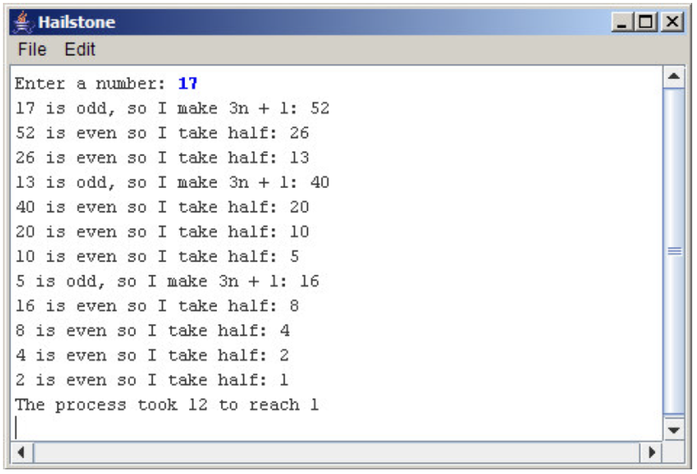

# სეტყვა
განვიხილოთ შემდეგი პროცესი:
აიღეთ ნატურალური რიცხვი n.
* თუ n ლუწია გაყავით 2 ზე.
* თუ n კენტია გაამრავლეთ 3 ზე და დაუმატეთ 1.

გააგრძელეთ ეს პროცესი მანამ სანამ n არ გახდება 1. 

ქვემოთ მოცემულია ეს პროცესი n = 15 ისთვის:
* 15 კენტია, ამიტომ ვაკეთებთ 3n+1: 46 
* 46 ლუწია, ასე რომ ვყოფთ ორზე: 23 
* 23 კენტია, ამიტომ ვაკეთებთ 3n+1: 70 
* 70 ლუწია, ასე რომ ვყოფთ ორზე: 35 
* 35 კენტია, ამიტომ ვაკეთებთ 3n+1: 106 
* 106 ლუწია, ასე რომ ვყოფთ ორზე: 53 
* 53 კენტია, ამიტომ ვაკეთებთ 3n+1: 160
* 160 ლუწია, ასე რომ ვყოფთ ორზე: 80 
* 80 ლუწია, ასე რომ ვყოფთ ორზე: 40 
* 40 ლუწია, ასე რომ ვყოფთ ორზე: 20 
* 20 ლუწია, ასე რომ ვყოფთ ორზე: 10 
* 10 ლუწია, ასე რომ ვყოფთ ორზე: 5 
* 5 კენტია, ამიტომ ვაკეთებთ 3n+1: 16 
* 16 ლუწია, ასე რომ ვყოფთ ორზე: 8 
* 8 ლუწია, ასე რომ ვყოფთ ორზე: 4 
* 4 ლუწია, ასე რომ ვყოფთ ორზე: 2 
* 2 ლუწია, ასე რომ ვყოფთ ორზე: 1

დაწერეთ ConsoleProgram, რომელიც კითხულობს ნატურალურ რიცხვს და გამოქვს პროცესის თითოეული ბიჯი. მაგალითი ნაჩვენებია სურათზე:

საგულისხმოა რომ ვერავინ მოახერხა იმის დამტკიცება, რომ ეს პროცესი ნებისმიერი საწყისი რიცხვისთვის დასრულდება, ანუ ერთამდე მივალთ - კოლაცის ვარაუდი.