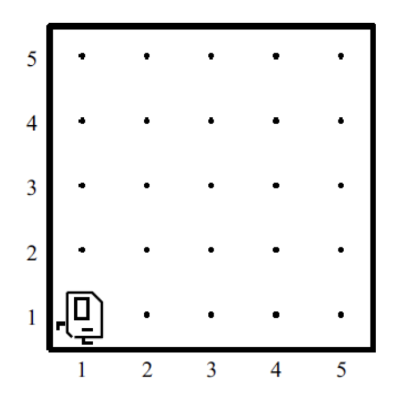
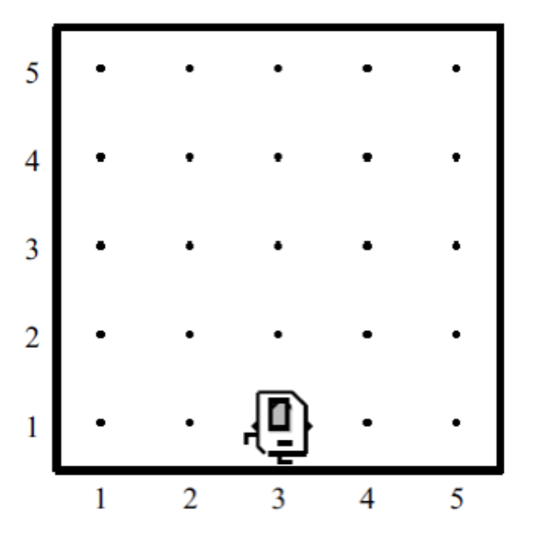

# ცენტრის პოვნა

ეს ამოცანა ალგორითმული ხასიათისაა. თქვენ უნდა დააპროგრამოთ კარელი ისე, რომ ბრილიანტი პირველი ქუჩის ცენტრში დადოს. მაგალითად, თუ კარელი ცხოვრობს შემდეგ სამყაროში:

პროგრამის დასრულების შემდეგ იგი უნდა იდგეს პირველი ქუჩის ცენტრში ერთ ცალ ბრილიანტზე, ისე როგორც მოცემულია შემდეგ სურათზე:

მიაქციეთ ყურადღება, რომ პროგრამის დამთავრების შემდეგ სამყარო უნდა შეიცავდეს მხოლოდ ერთ ბრილიანტს და ის პირველი ქუჩის შუაში უნდა იდოს. გზადაგზა კარელს შეუძლია ნებისმიერ ადგილზე დადოს ბრილიანტები, მაგრამ სანამ მუშაობას დაასრულებს ერთის გარდა ყველა უნდა აიღოს.
ამოცანის ამოხსნის პროცესში შეგიძლიათ დაეყრდნოთ შემდეგ ფაქტებს:

* კარელი ცხოვრებას იწყებს პირველი გამზირის პირველ ქუჩაზე, სახით აღმოსავლეთისკენ და მას აქვს უსასრულოდ ბევრი ბრილიანტი.
* სამყაროს საწყისი კონფიგურაცია არ შეიცავს კედლებს და ბრილიანტებს.
* სამყარო ყოველთვის **კვადრატული** ფორმისაა და მისი სიგრძე და სიგანე ერთმანეთის ტოლია.
* თუ სამყაროს სიგრძე კენტია, კარელმა ბრილიანტი უნდა განათავსოს შუა უჯრაზე. თუ სიგრძე ლუწია მაშინ კერელს შეუძლია განათავსოს ბრილიანტი ორიდან ერთერთ შუა უჯრაზე.
* არ აქვს მნიშვნელობა რომელი მიმართულებისკენ იქნება კარელი შებრუნებული როცა ის დაასრულებს მუშაობას.

გაითვალისწინეთ, რომ პროგრამა გამართულად უნდა მუშაობდეს ნებისმიერი სიდიდის სამყაროზე მათ შორის 1x1 სამყაროზეც.
ამოხსნა დაწერეთ MidpointFindingKarel.java ფაილში