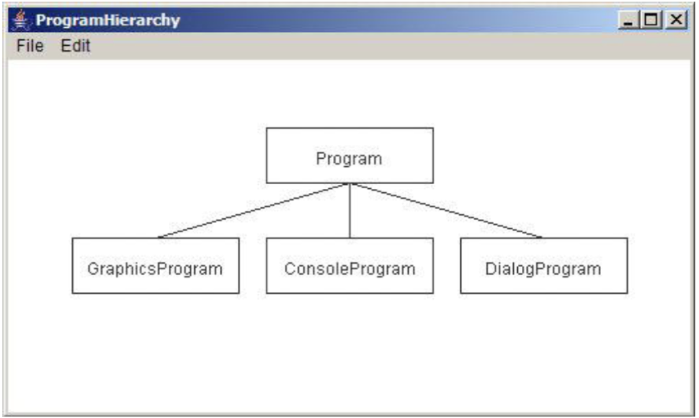

# ProgramHierarchy
დაწერეთ  GraphicsProgram პროგრამა, რომელიც დახატავს acm.program კლასთა იერარქიის ნაწილს დიაგრამის სახით. მაგალითი ნაჩვენებია სურათზე:

დიაგრამის დასახატად გამოიყენეთ GRect, GLabel, და GLine კლასები. ამ ამოცანაში მთავარ სირთულეს წარმოადგენს კოორდინატების სწორად მითითება.  თქვენ უნდა გაითვალისწინოთ შემდეგი მოთხოვნები:
* მართკუთხედების სიგრძე და სიგანე უნდა აღწეროთ როგორც კონსტანტები ისე, რომ ადვილად შეიძლებოდეს შეცვლა.
* კლასების სახელები უნდა იხატებოდეს მართკუთხედების ცენტრში. ტექსტის სიგრძის და სიგანის გაგება შეგიძლიათ label.getWidth() და label.getAscent() მეთოდების საშუალებით.
* შემაერთებელი ხაზები უნდა იწყებოდეს და მთავრდებოდეს მართკუთხედების შესაბამისი გვერდების ცენტრებიდან.
* მთლიანი დიაგრამა უნდა იყოს ფანჯრის ცენტში.

ამოხსნა დაწერეთ ProgramHierarchy.java ფაილში