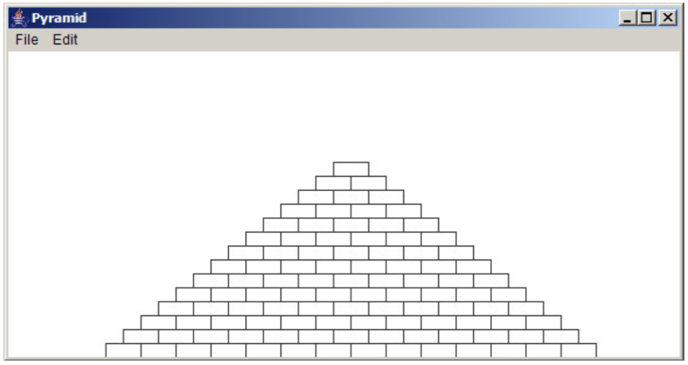

# პირამიდა
დაწერეთ GraphicsProgram პროგრამა რომელიც დახატავს პირამიდას. პირამიდა შედგება ჰორიზონტალურად განლაგებული აგურებისგან, ისე რომ ყოველ მომდევნო ხაზში (ქვემოდან ზემოთ)  აგურების რაოდენობა იკლებს ერთით.

პირამიდა უნდა დაიხატოს ფანჯრის ცენტრში, როგორც სურათზეა ნაჩვენები და უნდა იყოს აგებული მოცემული პარამეტრების მიხედვით:
BRICK_WIDTH თითოეული აგურის სიგრძე (30 pixels) 
BRICK_HEIGHT თითოეული აგურის სიმაღლე (12 pixels) 
BRICKS_IN_BASE აგურების რაოდენობა პირველ (ქვედა) ხაზში (14) 

ფრჩხილებში მოცემული პარამეტრები აღწერს სურათზე მოცემულ პირამიდას, მაგრამ ამ მონაცემების შეცვლის შემთხვევაშიც პირამიდა მაინც უნდა გამოვიდეს.

ამოხსნა დაწერეთ Pyramid.java ფაილში
