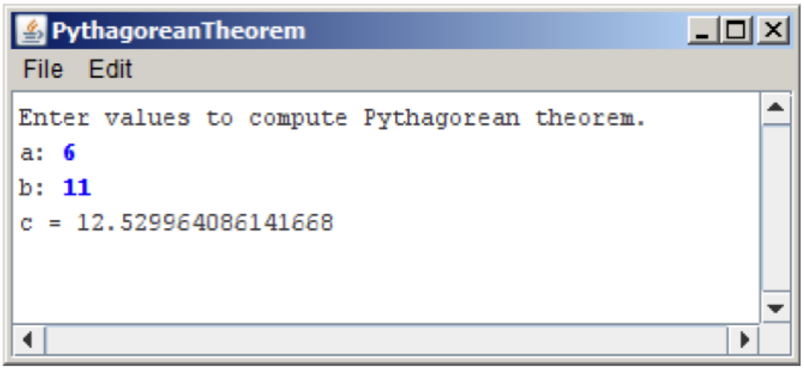

# პითაგორას თეორემა
დაწერეთ ConsoleProgram, რომელიც კონსოლიდან წაიკითხავს ორ  int ტიპის რიცხვს, მართკუთხა სამკუთხედის კათეტების მნიშვნელობებს. გამოთვლის ჰიპოტენუზას მნიშვნელობას და გამოიტანს ეკრანზე double ტიპის რიცხვს. 



შეგახსენებთ პითაგორას თეორემას:


$$
c^2 = a^2 + b^2
$$


სადაც  a და b მართკუთხა სამკუთხედის კათეტებია, c კი ჰიპოტენუზა.
პითაგორას თეორემა შეიძლება გადაიწეროს შემდეგნაირად:


$$
c = \sqrt{a^2 + b^2}
$$

რიცხვიდან ფესვის ამოსაღებად გამოიყენეთ `Math.sqrt` მეთოდი:
```java 
double y = Math.sqrt(x);
```
y–ს მიენიჭება ფესვი x–დან.

ამოხსნა დაწერეთ PythagoreanTheorem.java ფაილში