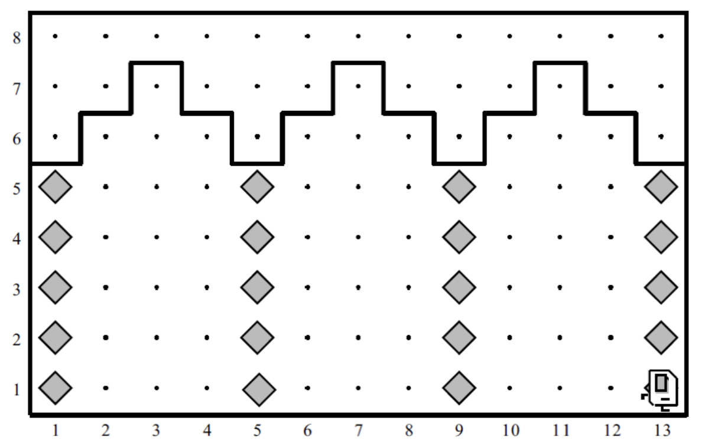

# თაღების შეკეთება
**კარელი** დაიქირავეს იმისთვის რომ შეაკეთოს მიწისძვრის მიერ მიყენებული დაზიანებები.
კონკრეტულად კი **კარელს** ევალება შეაკეთოს თაღები, რომელთა სვეტებსაც აკლია აგურები (აგურები, რა თქმა უნდა, წარმოდგენილია როგორც ბრილიანტები)

თქვენმა პროგრამამ სწორად უნდა იმუშაოს სამყაროში რომელიც ნაჩვენებია ზემოთ. მაგრამ, ასევე, უნდა იყოს საკმარისად ზოგადი, რათა **კარელმა** შეძლოს თაღების შეაკეთება ნებისმიერ სხვა სამყაროში, რომელიც აკმაყოფილებს ამოცანის ბოლოში მოყვანილ პირობებს. [ამ ბმულზე](https://drive.google.com/file/d/1ZRfyfwb30PMJ3zJ2Q7K9J2ge8GW4jBeK/view?usp=share_link) შგიძლიათ იხილოთ სხვადასხვა სამყაროების მაგალითები.

**კარელმა** უნდა შეავსოს  ყველა ის ადგილი სვეტებში სადაც აკლია აგური. ზემოთ მოცემული მაგალითისთვის სამყაროს საბოლოო სახე უნდა იყოს შემდეგი:

**კარელს** შეუძლია დაეყრდნოს შემდეგ ფაქტებს:
* მისი საწყისი პოზიცია ყოველთვის პირველი გამზირის პირველი ქუჩაა, იგი იყურება აღმოსავლეთისკენ და მას აქვს უსასრულოდ ბევრი აგური(ბრილიანტი).
* სვეტები დაშორებულია ერთმანეთისგან ზუსტად ოთხი ერთეულით, ისინი განლაგებულია პირველ გამზირზე, მეხუთე გამზირზე, მეცხრე გამზირზე და ა.შ. 
* ბოლო სვეტი არის სამყაროს ბოლოში, ანუ ბოლო სვეტის შემდეგ აუცილებლად არის სამყაროს საზღვრის კედელი. მოცემულ მაგალითში ბოლო სვეტი არის მე–13–ე გამზირზე, მაგრამ თქვენი პროგრამა უნდა მუშაობდეს სვეტების ნებისმიერი რაოდენობისთვის.
* სვეტის წვერო ზემოდან ასევე შემოსაზღვრულია კედლით, მაგრამ კარელმა არ უნდა ჩათვალოს ის რომ სვეტების სიმაღლე ყოველთვის 5 ერთეულია და ყველა სვეტი ერთი და იმავე სიმაღლისაა.
* ზოგიერთ სვეტს შეიძლება უკვე ჰქონდეს ზოგიერთი აგური, თქვენმა პროგრამამ არ უნდა დადოს მეორე აგური იქ სადაც უკვე არის ერთი.

ამოხსნა დაწერეთ StoneMasonKarel.java ფაილში