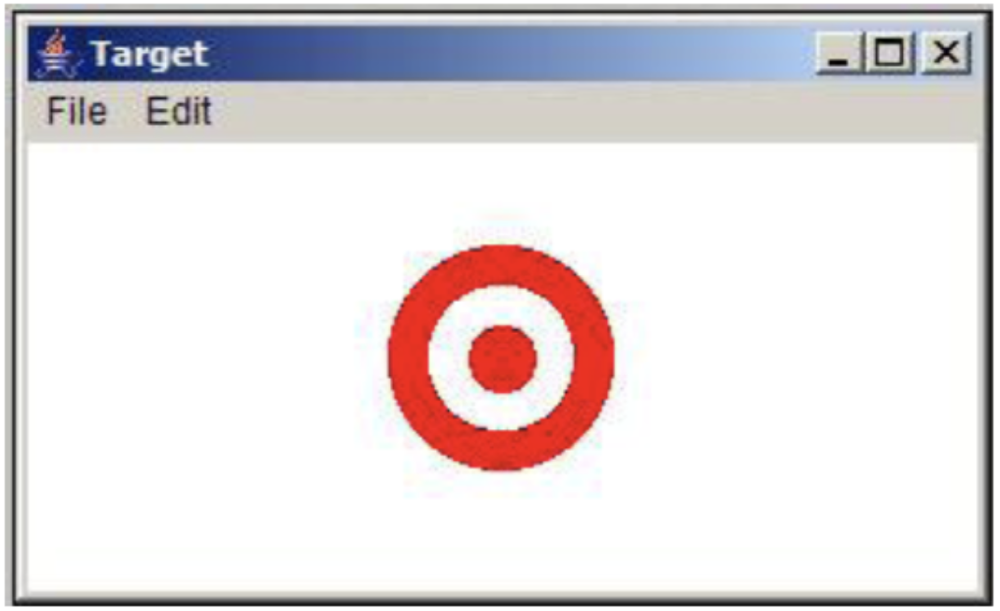

# მიზანი
თქვენ დაგიქირავს იმისთის, რომ დაწეროთ პროგრამა რომელიც დახატავს სამიზნეს. მაგალითი ნაჩვენებია სურათზე:

ფიგურა შედგება სამი GOval ტიპის ობიექტისგან, რომელთაგანაც ორი წითელია და ერთი თეთრი. გარეთა წრის რადიუსია 2.54სმ  (72 პიქსელი), თეთრი წრის რადიუსია 1.65 სმ და შიდა წრის რადიუსია 0.76 სმ. ფიგურა უნდა იყოს ფანჯრის შუაში.